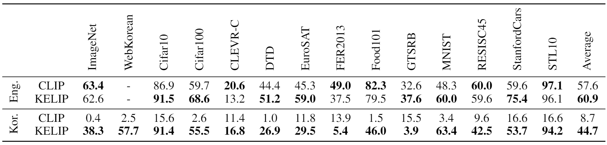
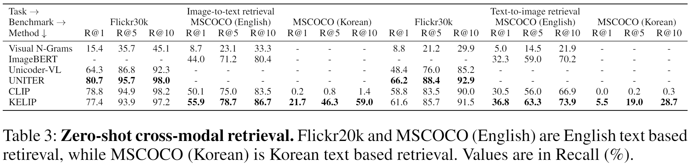

# KELIP

Official PyTorch implementation of *"Large-scale Bilingual Language-Image Contrastive Learning"* ([ICLRW 2022](https://meta.wikimedia.org/wiki/Wiki-M3L))

**Byungsoo Ko\*, Geonmo Gu\***
(* Authors contributed equally.)

@NAVER/LINE Vision

Paper | Colab | [Gradio Demo](https://huggingface.co/spaces/navervision/KELIP)

## Overview
KELIP is a Korean and English bilingual Contrastive Language-Image Pre-training model. Motivated by OpenAI's [CLIP](https://github.com/openai/CLIP), we trained a bilingual multimodal model with collected 1.1 billion image-text pairs (708 million Korean and 476 million English), which is three times larger than CLIP's dataset. KELIP shows competitive performance in zero-shot classification and cross-modal retrieval tasks for both languages. We found KELIP contains each language's cultural semantics and cross-lingual relation.

#### Zero-shot Classification


#### Zero-shot Cross-modal Retrieval


## Usage
We provide an easy-to-use KELIP API.

```
$ pip install git+https://github.com/navervision/KELIP.git
```

### Example

```python
import kelip
import torch
from PIL import Image
from urllib.request import urlretrieve

device = "cuda" if torch.cuda.is_available() else "cpu"

model, preprocess_img, tokenizer = kelip.build_model('ViT-B/32')
model = model.to(device)
model.eval()

urlretrieve('https://upload.wikimedia.org/wikipedia/commons/7/77/Sarabi-dog.jpg', 'dog.jpg')
image = preprocess_img(Image.open('dog.jpg')).unsqueeze(0).to(device)
text = tokenizer.encode(['a dog', 'a cat', 'a tiger', 'a rabbit']).to(device)
with torch.no_grad():
	image_features = model.encode_image(image, l2norm=True)
	text_features = model.encode_text(text, l2norm=True)

	logits_per_image, logits_per_text = model(image, text)
	probs = logits_per_image.softmax(dim=-1)

print("Label probs:", probs)
```

## Demo


```
$ pip install gradio
$ python demo/demo_zeroshot.py
```

## License
```
KELIP
Copyright 2022-present NAVER Corp.

Licensed under the Apache License, Version 2.0 (the "License");
you may not use this file except in compliance with the License.
You may obtain a copy of the License at

    http://www.apache.org/licenses/LICENSE-2.0

Unless required by applicable law or agreed to in writing, software
distributed under the License is distributed on an "AS IS" BASIS,
WITHOUT WARRANTIES OR CONDITIONS OF ANY KIND, either express or implied.
See the License for the specific language governing permissions and
limitations under the License.
```
