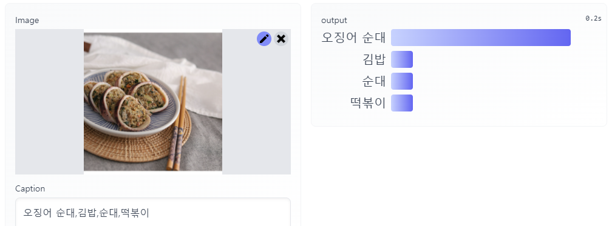
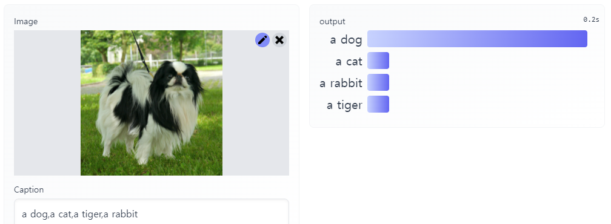
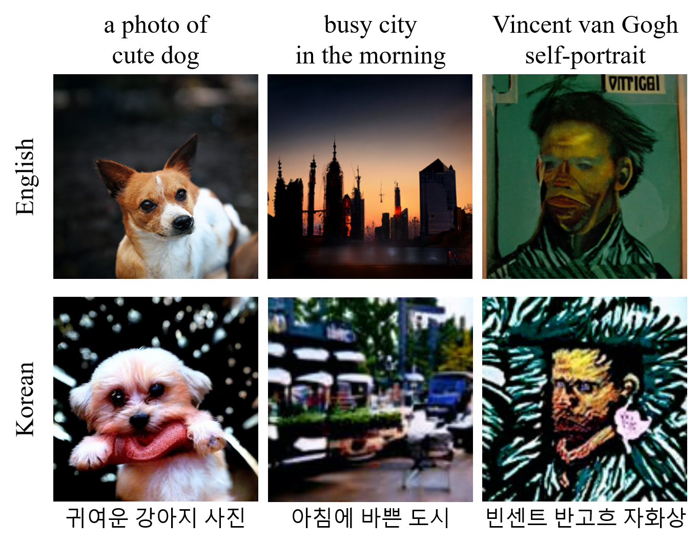

# KELIP

Official PyTorch implementation of *"Large-scale Bilingual Language-Image Contrastive Learning"* ([ICLRW 2022](https://meta.wikimedia.org/wiki/Wiki-M3L))

**Byungsoo Ko\*, Geonmo Gu\***
(* Authors contributed equally.)

@NAVER Vision

[[`Paper`](https://arxiv.org/abs/2203.14463)] [[`Gradio Demo`](https://huggingface.co/spaces/navervision/KELIP)] [[`BibTex`](https://github.com/navervision/KELIP#citing-kelip)] [[`Colab (Interacting with KELIP)`](https://colab.research.google.com/github/navervision/KELIP/blob/master/notebooks/Interacting_with_KELIP.ipynb)] [[`Colab (KELIP guided diffusion)`](https://colab.research.google.com/github/navervision/KELIP/blob/master/notebooks/KELIP_guided_diffusion.ipynb)]

## Overview
KELIP is a Korean and English bilingual Contrastive Language-Image Pre-training model. Motivated by OpenAI's [CLIP](https://github.com/openai/CLIP), we trained a bilingual multimodal model with collected 1.1 billion image-text pairs (708 million Korean and 476 million English), which is three times larger than CLIP's dataset. KELIP shows competitive performance in zero-shot classification and cross-modal retrieval tasks for both languages. We found KELIP contains each language's cultural semantics and cross-lingual relation.

#### Zero-shot Classification


#### Zero-shot Cross-modal Retrieval


## Usage
We provide an easy-to-use KELIP API.

```
$ pip install git+https://github.com/navervision/KELIP.git
```

### API

#### `kelip.build_model(model_name=...)`
Returns the pretrained model, TorchVision image transform, and tokenizer, specified by the model name. The pretrained model will be downloaded if necessary. Currently, we support only 'ViT-B/32' model.

```
model, preprocess_img, tokenizer = kelip.build_model('ViT-B/32')
```

The returns of `kelip.build_model()` supports the following methods:

#### `preprocess_img(img: PIL)`
Return a Tensor containing preprocessed input image. This can be used as the input to the visual encoder.

#### `tokenizer.encode(texts: str or List[str], context_length=77)`
Given a string or a list of strings as input, returns a Tensor, containing tokenized sequences of the input texts. This can be used as the input to the text encoder.

#### `model.encode_image(image: Tensor, l2norm: bool)`
Given a batch of images, returns the image features encoded by the vision encoder of the KELIP model. The feature can be L2 normalized by `l2norm=True`.

#### `model.encode_text(text: Tensor, l2norm: bool)`
Given a batch of text tokens, returns the text features encoded by the text encoder of the KELIP model. The feature can be L2 normalized by `l2norm=True`.

#### `model(image: Tensor, text: Tensor)`
Given a batch of images and text tokens, returns logit scores of image and text input, which are cosine similarities between the corresponding image and text features, times `logit_scale.exp()`.

### Example

```python
import kelip
import torch
from PIL import Image
from urllib.request import urlretrieve

device = "cuda" if torch.cuda.is_available() else "cpu"

model, preprocess_img, tokenizer = kelip.build_model('ViT-B/32')
model = model.to(device)
model.eval()

urlretrieve('https://upload.wikimedia.org/wikipedia/commons/7/77/Sarabi-dog.jpg', 'dog.jpg')
image = preprocess_img(Image.open('dog.jpg')).unsqueeze(0).to(device)
text = tokenizer.encode(['a dog', 'a cat', 'a tiger', 'a rabbit']).to(device)
with torch.no_grad():
    image_features = model.encode_image(image, l2norm=True)
    text_features = model.encode_text(text, l2norm=True)

    logits_per_image, logits_per_text = model(image, text)
    probs = logits_per_image.softmax(dim=-1)

print("Label probs:", probs)
```

## Demo
You can play with KELIP zero-shot classification in Huggingface [Gradio demo](https://huggingface.co/spaces/navervision/KELIP), or you can build a custom demo on your server.

```
# Install Gradio package
$ pip install gradio

# Run Gradio demo page
$ python demo/demo_zeroshot.py
```




## KELIP guided diffusion
We can generate images from Korean or English text prompts with KELIP guided diffusion. It uses OpenAI's 256x256 unconditional ImageNet [diffusion model](https://github.com/openai/guided-diffusion) together with KELIP to connect text prompts with images. Try out in [Colab (KELIP guided diffusion)](https://colab.research.google.com/github/navervision/KELIP/blob/master/notebooks/KELIP_guided_diffusion.ipynb).



## Acknowledgement
This repository is built based on the OpenAI's [CLIP](https://github.com/openai/CLIP) repository.

## License
```
KELIP
Copyright 2022-present NAVER Corp.

Licensed under the Apache License, Version 2.0 (the "License");
you may not use this file except in compliance with the License.
You may obtain a copy of the License at

    http://www.apache.org/licenses/LICENSE-2.0

Unless required by applicable law or agreed to in writing, software
distributed under the License is distributed on an "AS IS" BASIS,
WITHOUT WARRANTIES OR CONDITIONS OF ANY KIND, either express or implied.
See the License for the specific language governing permissions and
limitations under the License.
```

## Citing KELIP
If you find this repository useful, please consider giving a start :star: and citation:

```
@article{ko2022largescale,
      title={Large-scale Bilingual Language-Image Contrastive Learning}, 
      author={Byungsoo Ko and Geonmo Gu},
      journal={arXiv preprint arXiv:2203.14463},
      year={2022}
}
```
